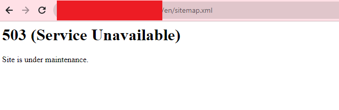
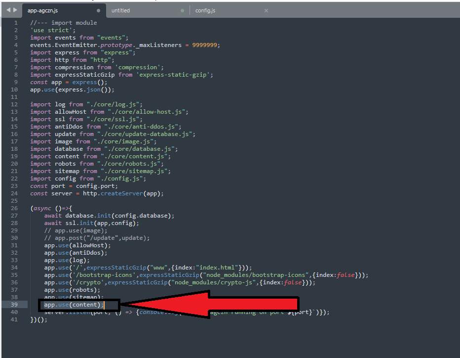

# agczn-maintenance-503
Membuat website agcnz ke dalam mode maintenance. Ini berfungsi agar content yang telah di index tidak lenyap dari peringkat saat website dalam perbaikan atau downtime.
Mengembalikan response code headers 503 hasil HTTP (Layanan Tidak Tersedia) yang memberi tahu crawler mesin pencari bahwa waktu henti tersebut bersifat sementara. Selain itu, ini memungkinkan pemilik situs untuk memberikan perkiraan waktu kepada pengunjung dan bot kapan situs akan aktif dan berjalan kembali.

# Catatan Penting
Panduan ini hanya dikhususkan untuk pengguna script agczn!

# Penjelasan
Dalam penjelasan pada artikel resminya [Lihat Disini](https://developers.google.com/search/docs/crawling-indexing/pause-online-business#best-practices-disabling-site). Google menyarankan, saat website dalam keadaan maintenance harus mematuhi beberapa hal berikut :
- Jangan larang semua perayapan di file robots.txt. Artinya file robots.txt harus tetap dapat di akses dan code response yang dikembalikan harus 200.
- Halaman Home harus dapat di akses dan code response harus 200 [Lihat Disini](https://developers.google.com/search/docs/crawling-indexing/pause-online-business#best-practices-disabling-site:~:text=If%20you%20need%20to%20disable%20the%20site%20for%20a%20longer%20time%2C%20then%20provide%20an%20indexable%20home%20page%20as%20a%20placeholder%20for%20users%20to%20find%20in%20Search%20by%20using%20the%20200%20HTTP%20status%20code.).

# Panduan Pemakaian

- Silahkan buka file `app-agczn.js`. Lalu perhatikan code pada baris 39. Lihat gambar berikut :
  
  

- Tepat di bawah baris code tersebut, silahkan pastekan code di bawah ini.

`

	app.use(async (req,res,next)=>{
		await res.writeHead(503,{
			"content-type":"text/html",
			"Retry-After" : 3600
		});
		await res.write("<h1>503 (Service Unavailable)</h1>
Site is under maintenance.
");
		return res.end();
	});

`
- Hasilnya harus seperti gambar berikut :
  
  

- Setelah itu, jangan lupa save code yang telah kamu tambahkan barusan.
- Selanjutnya silakan kamu restart pm2. `pm2 restart app-agczn`

# Tambahan
- Silahkan backup terlebih dahulu file `app-agczn.js` sebelum mengeditnya.
- Untuk menonaktifkan mode maintenance, silahkan hapus code yang sebelumnya kamu tambahkan lalu restart pm2 nya.
